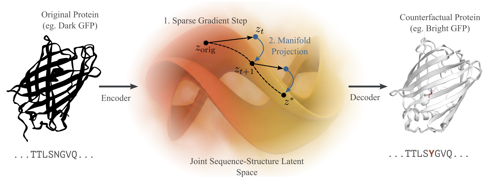

# MCCOP: Manifold-Constrained Counterfactual Optimization for Proteins

<div align="center">
  
</div>


This repository contains code accompanying our paper on **Protein Counterfactuals via Diffusion-Guided Latent Optimization**.


> ⚠️ **Work in progress:** This repository is under active development. Documentation, usability improvements, and pretrained checkpoints will be added shortly. The core pipeline is functional; see [Running Experiments](#-running-experiments) for current usage instructions.

<div align="center">

[](https://www.python.org/downloads/)
[](https://www.docker.com/)
[](https://wandb.ai)
[](https://github.com/mit-ll-responsible-ai/hydra-zen)
[](LICENSE)

</div>

## 📖 Abstract
Deep learning models can predict protein properties with unprecedented accuracy but rarely offer mechanistic insight or actionable guidance for engineering improved variants. When a model flags an antibody as unstable, the protein engineer is left without recourse: which mutations would rescue stability while preserving function?
We introduce Manifold-Constrained Counterfactual Optimization for Proteins (MCCOP), a framework that computes minimal, biologically plausible sequence edits that flip a model's prediction to a desired target state.
MCCOP operates in a continuous joint sequence-structure latent space and employs a pretrained diffusion model as a manifold prior, balancing three objectives: validity (achieving the target property), proximity (minimizing mutations), and plausibility (producing foldable proteins).
We evaluate MCCOP on three protein engineering tasks - GFP fluorescence rescue, thermodynamic stability enhancement, and E3 ligase activity recovery - and show that it generates sparser, more plausible counterfactuals than both discrete and continuous baselines.
The recovered mutations align with known biophysical mechanisms, including chromophore packing and hydrophobic core consolidation, establishing MCCOP as a tool for both model interpretation and hypothesis-driven protein design.

## 📂 Project Structure

```
mccop/
├── mccop/
│   ├── configs/              # Hydra-zen configuration modules
│   │   ├── base.py           # Base run configs (wandb, job, sweep)
│   │   ├── baselines.py      # Baseline method configs (GA, Hill Climbing, Gradient Descent)
│   │   ├── data.py           # Dataset configs (fluorescence, stability, activity)
│   │   ├── mccop.py          # Main MCCOP config
│   │   ├── preprocessing.py  # Preprocessing pipeline configs
│   │   ├── predictor.py      # Predictor architecture
│   │   ├── smoother.py       # Smoothing pipeline configs
│   │   ├── trainer.py        # PyTorch Lightning trainer configs
│   │   └── tasks/            # Task-specific entry-point configs with sweeps
│   ├── counterfactual/       # MCCOP optimization loop, losses & baselines
│   ├── data/                 # Dataset loading
│   ├── models/               # Predictors, autencoder and diffusion model wrappers
│   ├── preprocessing/        # Data preprocessing utilities
│   ├── smoothing/            # Predictor smoothing (spectral norm, Jacobian reg, etc.)
│   ├── tests/                # Unit tests
│   ├── utils/                # Helpers, constants, logging
│   ├── generate_counterfactuals.py  # Entry point: generate counterfactuals
│   └── train_predictor.py           # Entry point: train property predictor
├── Dockerfile
├── .devcontainer.json
├── pyproject.toml
├── uv.lock
└── README.md
```

## 📋 Table of Contents

- [📖 Overview](#-overview)
- [✨ Key Features](#-key-features)
- [🏗️ Architecture](#️-architecture)
- [📂 Project Structure](#-project-structure)
- [🔧 Installation & Setup](#-installation--setup)
  - [Option 1: Docker (Recommended)](#option-1-docker-recommended)
  - [Option 2: Apptainer (HPC Cluster)](#option-2-apptainer-hpc-cluster)
- [📦 Package Management](#-package-management)
- [🧪 Running Experiments](#-running-experiments)
  - [1. Train a Property Predictor](#1-train-a-property-predictor)
  - [2. Generate Counterfactuals](#2-generate-counterfactuals)
  - [WandB Logging](#wandb-logging)
  - [Slurm Jobs & Sweeps](#slurm-jobs--sweeps)
- [📊 Datasets](#-datasets)
- [🛠️ Development](#️-development)
- [📄 Citation](#-citation)
- [🙏 Acknowledgements](#-acknowledgements)

## 🔧 Installation & Setup

### Prerequisites

- **GPU** with CUDA 12.4+ support (recommended for training and counterfactual generation)
- **Docker** or **Apptainer** for containerized environments
- A [Weights & Biases](https://wandb.ai) account (optional for local runs)

### Option 1: pip

1. **Clone the repository:**
  ```bash
  git clone https://github.com/weroks/mccop.git
  cd mccop
  ```

2. **Install in editable mode (recommended for development):**
  ```bash
  pip install -e .
  ```

  Or install directly from GitHub:
  ```bash
  pip install "git+https://github.com/weroks/mccop.git"
  ```

### Option 2: Docker

1. **Install the [Dev Containers](https://marketplace.visualstudio.com/items?itemName=ms-vscode-remote.remote-containers) extension** in VSCode.

2. **Open the repository in the Dev Container:**

   Click `Reopen in Container` in the pop-up, or open the command palette (`Shift+Alt+P` / `Shift+Cmd+P`) and type `Dev Containers: Reopen in Container`.

   Alternatively, build and run manually:

   ```bash
   docker buildx build -t mccop .
   docker run \
     -it \
     --rm \
     --platform=linux/amd64 \
     -v "$PWD":/srv/repo \
     mccop \
     /bin/bash
   ```

### Option 2: Apptainer (HPC Cluster)

1. **Authenticate with the container registry:**

   ```bash
   apptainer remote login --username <your GitHub username> docker://ghcr.io
   ```

2. **Connect to compute resources:**

   ```bash
   # CPU
   srun --partition=cpu-2h --pty bash

   # GPU
   srun --partition=gpu-2h --gpus-per-node=1 --pty bash
   ```

3. **Launch the container:**

   Open a shell:
   ```bash
   apptainer run --nv --writable-tmpfs oras://ghcr.io/weroks/mccop:latest-sif /bin/bash
   ```

   Or connect via VSCode Remote Tunnels (install the [Remote Tunnels](https://marketplace.visualstudio.com/items?itemName=ms-vscode.remote-server) extension first):
   ```bash
   apptainer run --nv --writable-tmpfs oras://ghcr.io/weroks/mccop:latest-sif code tunnel
   ```

   Then in VSCode: `Ctrl+Shift+P` → "Connect to Tunnel" → select your node.

   > 💡 You can specify a version tag (e.g., `v0.0.1`) instead of `latest`.

## 🧪 Running Experiments

All entry points use **hydra-zen** for configuration. Hydra automatically generates a `config.yaml` in `outputs/<date>/<time>/.hydra` for full reproducibility.

### 1. Train a Property Predictor

```bash
python mccop/train_predictor.py dataset=tape_fluorescence model=mlp
```

### 2. Generate Counterfactuals

MCCOP uses a **pretrained DiMA diffusion model** as the manifold prior — no diffusion model training is needed. The smoothing steps are executed as part of the counterfactual generation once for each smoothing config.

```bash
python mccop/generate_counterfactuals.py dataset=fluorescence editor=base
```

You can override default parameters on the command line:

```bash
# Change sparsity mechanism
python mccop/generate_counterfactuals.py dataset=stability editor=base editor.sparsity_mechanism=kl_sparsity

# Turn off manifold projection
python mccop/generate_counterfactuals.py dataset=activity editor=base editor.project_on_manifold=False
```

Run all baselines across all datasets and 3 seeds:

```bash
python mccop/generate_counterfactuals.py cfg/job=baselines
```

### WandB Logging

Create a `.env` file in the repository root (note that the project name can also be overriden when specifying a sweep config):

```bash
WANDB_API_KEY=your_api_key
WANDB_ENTITY=your_entity
WANDB_PROJECT=mccop
```

Enable logging:
```bash
python mccop/generate_counterfactuals.py cfg/wandb=base
```

💡 We use [ESM3](https://huggingface.co/EvolutionaryScale/esm3-sm-open-v1) for structure prediction and evaluation, which is gated behind a non-commercial license. You will need to request access and then add you huggingface token to the .env file as well:
```bash
HF_TOKEN=your_huggingface_token
```

### Slurm Jobs & Sweeps

Submit a single job to the cluster:

```bash
python mccop/generate_counterfactuals.py cfg/job=base
```

Run a distributed parameter sweep:

```bash
python mccop/generate_counterfactuals.py cfg/job=sweep
```

Both automatically enable WandB logging. See `mccop/configs/` to configure job and sweep settings.

## 📊 Datasets

MCCOP is evaluated on three protein engineering benchmarks:

| Dataset | Property | Task | Source |
|---|---|---|---|
| **TAPE Fluorescence** | GFP fluorescence intensity | dark → bright | [Sarkisyan et al., 2016](https://doi.org/10.1038/nature17995) / [TAPE](https://github.com/songlab-cal/tape) |
| **TAPE Stability** | Proteolysis-based thermodynamic stability | unstable → stable | [Rocklin et al., 2017](https://doi.org/10.1126/science.aan0693) / [TAPE](https://github.com/songlab-cal/tape) |
| **Ube4b Activity** | E3/E4 ligase auto-ubiquitination activity | inactive → active | [Starita et al., 2013](https://doi.org/10.1534/genetics.113.155929) |

Data preprocessing details and download instructions will be provided shortly.


## 📄 Citation

*Citation information will be made available upon publication.*

<!--
If you find this work useful, please cite:

```bibtex
@inproceedings{
  anonymous2026protein,
  title={Protein Counterfactuals via Diffusion-Guided Latent Optimization},
  author={Anonymous},
  booktitle={International Conference on Learning Representations},
  year={2026},
  url={https://openreview.net/forum?id=PLACEHOLDER}
}
```
-->

## 🙏 Acknowledgements

This codebase builds on several excellent open-source projects:

- [CHEAP](https://github.com/amyxlu/CHEAP) — Compressed Hourglass Embedding Adaptations of Proteins
- [DiMA](https://github.com/MeshchaninovViacheslav/DiMA) — Pretrained diffusion model for protein embeddings (used as manifold prior)
- [ESMFold / ESM-2](https://github.com/facebookresearch/esm) — Protein language model and structure prediction
- [ESM3](https://github.com/evolutionaryscale/esm) — Structure prediction and confidence scoring
- [hydra-zen](https://github.com/mit-ll-responsible-ai/hydra-zen) — Type-checked Hydra configurations
- [submitit](https://github.com/facebookincubator/submitit) — Slurm job submission from Python

The project infrastructure is based on a [cluster ML template](https://github.com/marvinsxtr/ml-project-template).